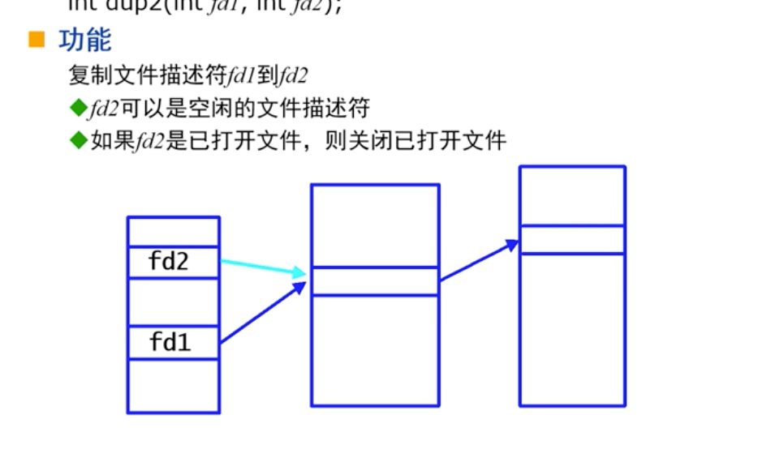

# 进程

## 进程的基本概念

#### 进程

包括：指令段，用户数据段，系统数据段的***执行环境***

#### 程序

指令和数据的集合，存放在磁盘上的文件中，文件的i节点中标为可执行

#### 两者的关系

1. 进程运行的时候，磁盘上的程序文件不可修改删除（分段编译/解释运行）
2. <font color = red>程序会初始化进程的指令段和用户数据段</font>
3. 初始化后，进程和初始化它的程序之间没有关系
4. 同时运行的多个进程可以由统一程序初始化得到，进程之间没有关系

## 进程的组成部分

#### 指令段

1. 大小固定不变，且只读
2. 包含CPU的指令代码，包括CPU指令代码以及调用的库函数代码


#### 用户数据段

1. 全局变量，静态变量，字符串常数
2. <font color = red>允许数据增长缩小</font>，实现内存的动态分配，C语言中使用malloc和free函数，调整单位为“页”


#### 用户栈

实现函数的调用

1. 用户保存子程序的返回地址
2. 在函数和被调函数之间传递参数
3. 函数体内定义的变量（除了静态变量）

存放main函数得到的命令行参数以及环境参数

1. <font color = red>存放在栈的最底部</font>

   >理解：main的命令行参数不是最开始写死在程序里，而是通过运行时手动输入，所以放在栈内
   
2. main函数运行之前，这部分就被初始化了

用户栈会有动态增长：在初始化的时候，用户栈的大小是有一个恒定值，但如果超过了这个值，CPU中的内存管理部件会产生一个中断，重新分配栈的大小。但同时，这个增长也会有一个限制，防止无限递归


#### 系统数据段

上述三部分在***进程私有且独立的***逻辑地址空间，可以在操作系统下以用户态进行访问

系统数据段则<font color = red>是内核的数据</font>，每个进程对应一套，包括页表和进程控制块PCB

全局变量在未初始化的时候，初值为0，而子函数内部的变量未初始化的时候，初值随机

每个进程的虚拟地址空间中会存在一个空闲区，用于为数据段和用户堆栈分配额外的空间（拓展栈或者malloc）

<font color = green>系统数据段通常包括以下信息：</font>

1. 页表
2. 进程状态和优先级
3. 当前目录，根目录
4. PID和PPID，umask值
5. 进程组组号
6. 核心堆栈（体积较大）
7. 打开的文件描述符


### 虚拟地址到物理地址的转换

1. 虚拟地址（VA）从指令中取出后，共长32bit，分为页号和页内偏移量两个部分
2. 通过页表查询虚拟页表的对应物理页表，取出逻辑地址对应的物理地址


## 进程的运行状态

### PCB

分为两个部分：user结构和proc结构

#### user结构

进程运行时才需要的数据在这里，核心态堆栈占用了较多的空间

#### proc结构

进程不运行时需要的数据在这里，用户程序不能直接修改和存取，只能通过系统调用来修改或调用

通常包括以下指令：

```shell
chdir, umask, open, close, getpid, getppid
```


### 进程的基本状态

进程创建之后，主要有的状态是运行和阻塞状态（睡眠状态）

内核<font color = red>只时分处理运行状态</font>，不处理阻塞状态的进程

阻塞的进程在阻塞期间是不占用CPU时间


### 调度优先级

1. 内核按照优先级调度进程，且进程的优先级总是在变化
2. 阻塞的进程被唤醒后，被赋予***高优先级***，保证人机会话操作和其他外设的响应速度
3. 用户可以使用nice()系统调用，有限地调整进程的优先级，普通用户只能调低自己的优先级，只有root用户可以提高
4. 优先级调整方案：运行时间长的进程，优先级会降低，但对应的运行时间片会比较长


### 阻塞态的恢复

在程序中执行语句：

```c
scanf("%d",&n);
```

1. 首先，`scanf`调用库函数的`read`，从用户态进入核心态
2. `read`进行系统调用，s调取驱动程序`ttyread`驱动，执行`sleep`函数，使进程进入休眠状态
3. 同时，另一个驱动程序`ttyintr`会监听输入，如果输入完成，执行内部的`wakeup`函数唤醒进程


### 进程的执行时间

进程的<font color = red>大部分时间都位于阻塞态</font>

进程的时间通常包括如下部分：睡眠时间，CPU时间。CPU时间由根据进程状态分为用户时间和系统时间（内核态下执行的时间）


### 忙等待

程序在循环中不停的执行查询等操作，导致CPU被持续占用。

多使用sleep函数使进程进入阻塞态，降低CPU的执行频率


# 进程的创建和重定向

## 进程的生命周期

#### 进程的PCB中部分信息

1. 页表：作为管理数据，占分配的虚拟内存的1024分之一
2. 打开的文件描述符表
3. 核心态堆栈
4. 进程信息，优先级等
5. 当前目录
6. PID


#### 进程的创建：fork创建

1. fork是Unix下创建新进程的唯一方式

2. 原先的进程为父进程，新创建的为子进程

3. 新的进程完全复制父进程的指令，用户数据段和堆栈段，部分复制系统数据段

4. fork返回值：

   1. 父子进程都收到返回值，但不相同
   2. 父进程收到的返回值>0,是子进程的PID
   3. 子进程返回值为0，失败时返回-1

5. 内核环境下，复制父进程的PCB和内存资源给子进程，且父子进程可以共享数据和程序

6. 如果父子进程需要对同一个数据进行读操作，则不会发生冲突（都指向下图中的12）。如果都需要对某个数据进行写操作，则子进程会出发一个中断，由操作系统复制一份需要写的数据给子进程（子进程指向了新开辟的24）

   

   


### fork的执行

fork执行之后，两个进程都从fork之下的语句开始执行

```c
if(fork() > 0) //父进程
{
  	printf("%d",getpid());
}
else if(fork() == 0) //子进程
{
  	print("%d %d", getpid(), getppid);
}
else  //子进程创建失败
{
  	printf("Process init failed");
}
```

判断部分中，系统先执行判断中的fork，创建进程之后，系统下一步需要执行的是判断语句，如果得到的返回值为0，说明是子进程


#### exec系统调用

使用一个指定的程序文件，重新初始化一个进程

> 和fork的区别：
>
> fork是重新创建一个进程，而exec是废除当前的进程，重新初始化所有的指令段等，也可以<font color = red>命令行参数和环境参数</font>

exec不创建新的进程，只是将当前进程重新初始化指令段和用户数据段，堆栈段以及CPU的PC指针

```c
int execl(char *file, char *arg0, char arg1……)
int execlp(char *file, char *arg0, char arg1……,0)
  //带有p的exec，如果file没有指定路径，则系统会按照path环境变量的要求去寻找文件
```


#### 僵尸进程

1. 设计目的：子进程结束之后，需要向父进程报告终止的状态。
2. 进程生命周期结束时的状态：系统已经释放了进程占用的包括内存在内的系统资源，但仍在内核中保留进程的部分数据结构，记录进程的终止状态，等待父进程收尸
3. 父进程收尸后，僵尸进程将消失
4. 僵尸进程占用的系统资源很少，只占用***内核进程表的资源***
   1. 过多的僵尸进程会导致进程表被用光
   2. 当进程表被用光之后，就算系统中还有足够的内存资源，新的进程依然无法被创建，甚至连killall命令(killall指令是外部指令，kill才是内部指令）和reboot指令也无法执行，可以使用Ctrl-C强行停止进程或者kill指令删除
5. 孤儿进程：父进程提前在子进程之前结束


#### wait系统调用

##### 功能

等待进程的子进程终止

如果已经有子进程终止，则立即返回，返回已经终止的子进程PID


## 进程与文件描述符

#### 活动文件目录

磁盘文件目录：分为两级：文件名和i节点

活动文件目录：分三级

1. 文件描述符表
   1. 每个进程一张，在PCB中user结构里
   2. user中整形数组u_ofile记录进程打开的文件
   3. 文件描述符fd是u_file的下标
2. 系统文件表
   1. 整个核心只有一张，file结构
3. 活动i节点表
   1. 整个核心一张，inode结构
   2. 内存中inode表是外存中inode表的缓冲
   3. 内存inode表里有专用的***引用计数***，记录文件被引用的数目

### 父子进程对文件的继承

父进程在fork之前打开的文件，父子进程会同时指向该文件，共享文件的指针

也就是说，父进程向下读取10个字节，子进程在读取的时候，会从第11个字节开始读取10个字节，父进程下一次读取，会从21个字节开始读取


## 重定向

### 系统调用dup2

```c
int dup2(int fd1, int fd2)
  //复制文件描述符fd1到fd2，如果fd2是已经打开的文件，则关闭已经打开的文件
```



