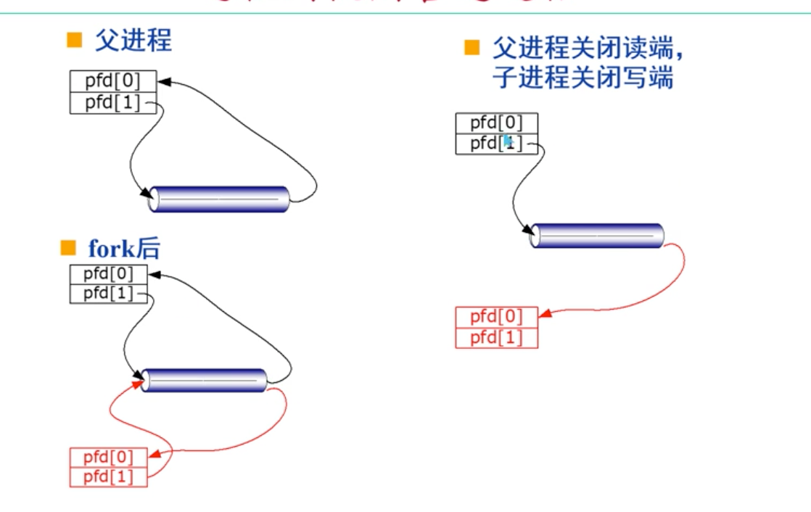
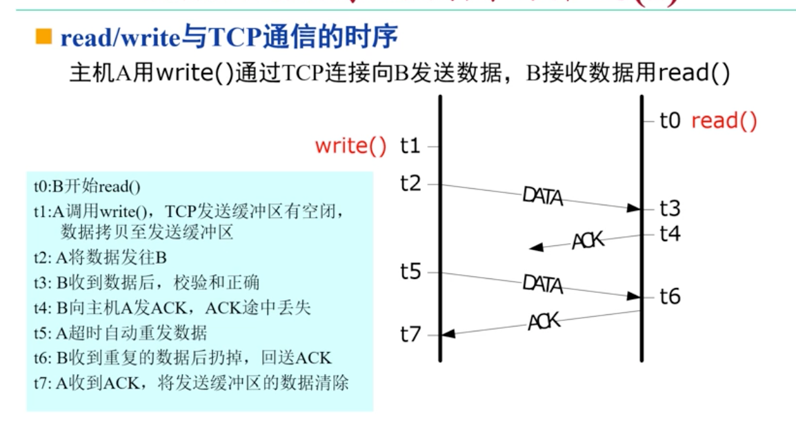

# 管道和重定向

## 管道

### 管道操作

#### 创建管道

```c
int pipe(int pfd[2])
//创建一个管道，pfd[0]和pfd[1]分别为管道两端的文件描述字，pfd[0]用于读，pfd[1]用于写
```


#### 管道写

```c
ret = write(pfd[1],buf,n)
// 如果管道已满， 则被堵塞，直到另一端read将管道内的数据被读取走为止 
//ret是一个返回值，表明管道内到底实际写入了多少值，不一定和n相等，甚至可能为负值（表示写入失败）
```


#### 管道读

```c
ret = read(pfd[0],buf, n)
  //如果管道的写端已经关闭，返回0
  //如果管道为空，写端文件描述字未关闭，则被阻塞
  //如果管道不为空，最多读取n个字节（可能管道中没有n个字节可供读取）
  //实际读取的数目作为read的返回值
```


#### 关闭管道close

关闭写端则读端read调用返回0

关闭读端，则写端收到SIGPIPE信号，返回-1，errno被设为EPIPE


### 进程之间使用管道




### 管道的特点

1. 管道是一个无记录边界的字节流，在读写的时候，数据是流式读取，没有明确的边界

2. 父子进程之间双向通信的时候，通常应该采用两个管道

   > 可以只使用一个管道，但可能会使得进程收到自己刚写进去的数据，需要额外的调度

3. 父子进程使用两个管道传递数据，可能会导致死锁。通常是因为流量控制的问题

   > 父进程向输出管道写，写满，导致被阻塞
   >
   > 子进程同时在向写回的管道写，写满，同样被阻塞
   >
   > 双方都因为写满被阻塞，而没法读取，导致进程死锁


### 命名管道

pipe创建的管道属于匿名管道，只限于同祖先进程之间通信

#### 命名管道

允许没有共同祖先的进程访问FIFO管道

使用shell创建一个命名管道

```shell
mknod pipe0 p # 管道名为pipe0，文件类型为p
```

```c
// 发送者需要写入，则按照以下方式调用
fd = open("pipe0", O_WRONLY);
write(fd, buf, len);

//接受者需要读出，按照以下方式调用
fd = open("pipe0", O_RDONLY);
read(fd, buf, sizeof(buf));
```


## 信号

### kill命令

```shell
kill -signal PID-list
kill 1275 # 杀死1275编号的进程
kill -9 1326  # 向1326进程发送一个信号9，使其死亡
```


### 进程组

进程在PCB中有一个p_pgrp域，相同p_pgrb的进程构成一个进程组

如果p_pgrb=p_pid，则该pid的拥有者是该组的组长进程

fork创建的进程会继承父进程的组

> setsid()系统调用可以将PCB中的p_pgrb改为自己本身的PID，从而脱离原来的分组，并将自己命名为新分组的组长

#### 使用

如果kill命令的PID为0的时候，将同组的所有进程杀死


### 信号机制

信号本质上是送到进程的软件中断，通知进程出现了非正常事件

通常，信号通过kill()或者alarm()调用


#### 内核产生信号的情况

1. 进程试图读取地址空间外的存储单元时，内核向进程发送违例信号
2. 浮点溢出信号：0作为除数
3. 关闭管道读端，写端还在write


#### 进程对信号的处理方式

1. 大部分情况下， 缺省设置为终止处理方式

   ```c
   signal(SIGINT,SIG_DFL)
   ```

   

2. 信号被忽略

   ```c
   signal(SIGINT,SIG_IGN)
     //进程不会再收到SIGINT信号，并且这个进程创建的子进程也会继承这个属性
   ```

   

3. 信号被捕捉，并根据信号的种类调用对应的函数


## 进程间协作

### 信号灯模式

控制多进程对共享资源的互斥访问，以及进程之间的同步

#### 策略和机制分离

系统只提供信号灯机制，但进程必须自己考虑如何调用PV操作来避免死锁或者同步问题


#### 创建

```c
int semget(int key, int nsems, int flags)
  //创建一个新的或者获取一个已经存在的信号灯组
  nsem：该信号灯组中包含多少个信号灯
  flags：创建还是获取
  返回信号灯组的ID或者-1（调用失败）
```


#### 信号灯的删除

```c
int semctl(int sem_id, int snum, int cmd, char *arg)
  /*
  作用：对信号灯进行控制
  参数分别为：信号灯的id，信号灯在灯组中的编号，控制命令，执行这一命令需要的参数。返回值为-1表示失败，其他返回值需要依靠cmd具体判断。删除的cmd为IPC_RMID
  */
```


#### 信号灯的操作

```c
int semop(int sem_id, struct sembuf *ops, int nops)
```

sembuf中，参数sem_op决定PV操作

- sem_op < 0：P操作

- Sem_op > 0：V操作

- 等于0的时候，不修改信号灯的值，等待变为非负数

ops：有nops个元素的结构体数组，每个元素描述对某一信号灯的操作

> 原子性：一次semop调用指定的多个信号灯的操作，Linux内核会一次性执行完所有的这些操作，或者压根不执行


### 共享内存

多个进程共同使用一段物理内存

使用共享内存的数据传输块，但需要进程自己解决共享内存的互斥问题

#### 用途

1. 数据交换
2. 运行监视


## Socket通信

### TCP协议下客户端和服务端

#### 客户端

```c
//创建一个Socket对象，采用TCP协议，以及流式传输
sock = socket(AF_INET, SOCK_STREAM, IPPROTO_TCP)
//接下来为这个对象分配具体的IP地址，端口等信息
...
//分配完成后，进行连接
connect(socke, (struct sockaddr *)&name, sizeof(name))
//如果connect大于0，表示连接成功
```

1. 如果发送的速率高于网络的通信速率，socket会对数据进行阻塞
2. 端口号如果不指定分配的话，由操作系统进行分析
3. connect：设立远端端点名，建立TCP连接，执行时使系统进入阻塞态


#### 服务端

```c
//同样先创建一个Socket对象，采用TCP协议，以及流式传输
sock = socket(AF_INET, SOCK_STREAM, IPPROTO_TCP)
//接下来为这个对象分配具体的IP地址，端口等信息
...
//分配完成后，进行连接
bind(admin_sock, (struct sockaddr *)&name, sizeof(name));
listen(admin_sock, 5);

data_sock = accept(admin_sock, 0, 0);
```

1. bind操作的含义：
   1. 指定一个socket本地端口号，将socket的端口与这个通信口绑定

2. listen操作：不会使进程进入阻塞态，而是向操作系统发送一个信号，表示自己需要持续监听符合条件的IP数据包和端口。数字5表示可以同时接受5个连接请求（而不是同时保持5个连接请求）
3. accept：使进程进入阻塞态
   1. 返回值为一个socket


### 多进程并发的socket

服务器接受多个客户端的时候，accept接受一个绑定信号，返回一个socket，包含对方的IP地址和端口号

```c
data_sock = accept(admin_sock, (struct sockaddr*)&peer, &name_len);
```

peer缓存客户端传来的IP地址和端口号。如果绑定成功，将缓存信息传递给data_sock，如果绑定失败，返回-1


#### read/write调用



<font color = red>几个重要的点：</font>

1. write的返回值如果不是-1，表示的是数据写入到发送缓冲区的大小，不是发送到对方的大小。所以，write是在图中的t1时刻就产生了返回值，至于数据是否发送到了对方那里，write不会提示
2. read的返回值是在t3时刻产生，即：只要收到数据，就产生一个返回值。至于自己的ACK是否返回到对方那里，并不会做出提示
3. 双方的默认存活时长是2h
4. read和write是流式传输，会存在黏连问题


#### shutdown关闭

1. 在TCP协议下：
   1. 允许关闭发送方向的半个连接，而无法关闭对方的发送
   2. TCP的流量控制机制可以使得自己的接受窗口设为0，使对方的发送数据在缓冲区堆积
2. 在UDP协议下：
   1. 关闭接收方向，内核会记录这个操作，但不会拒绝对方发送来的数据
   2. 对方发送的数据会被直接丢弃，但对方并不会知晓这里已经关闭了窗口


#### 单进程并发处理

只在服务端启用一个进程处理多个客户端发来的socket连接


#### select调用

使得用户进程可以同时等待多个事件发生，用户进程在一个或者多个事件发生的时候，select返回，否则睡眠等待

##### select的准备

1. 读集合中，文件描述符的read不会阻塞
2. 写集合中write不会阻塞
3. 信号集合中，某文件描述符出现了异常情况
   1. 在TCP协议中，只有加急数据到达才算异常情况

##### select的时间参数

select 的最后一个参数timeout

1. 如果定时值不为0，则select在某一个描述符IO就绪时立刻返回，否则等待不超过timeout规定的时限。timeout通常为微秒级的精度
2. 如果定时值为0，执行无阻塞方式查询，立即返回数据
3. 如果是NULL空指针，select会一直等待下去，没有规定时限