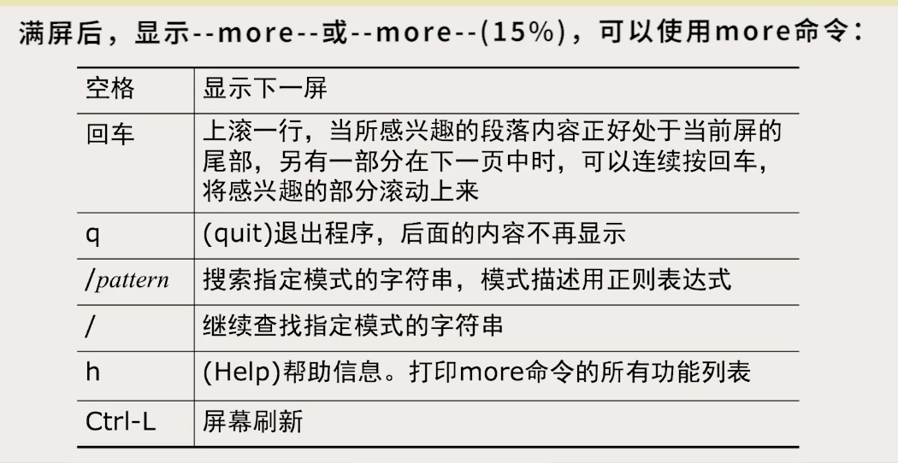

# 第二章：系统查看工具

## 行律

#### 作用

1. 一行内字符的缓冲，回显与编辑，直到按下回车

2. 将Ctrl-C转换为终止进程运行的信号。终端的Ctrl-C依然是通过字节流传入主机，经过行律进行转换了而已

3. 数据加工：将\n转为\r\n

#### <span style = "color :red"> 行律运行在主机端，对终端发送来的信息进行加工</span>

#### 调整

通过命令stty实现自定义命令

 ```powershell
 stty erase ^H  # 将Ctrl-H作为擦除命令
 ```

## 用户

#### root用户

1. 不受权限约束，可以任意删改文件
2. 创建新用户：useradd命令，用户信息存放在/etc/passwd文件中，还包括登录的Shell

#### 终端登录

##### Shell提示符

$ 符号表示执行Shell指令

\# 表示当前用户为超级用户

## 基本Linux命令

### man命令：查阅手册

```powershell
man name  # 查阅name的功能
man section name  # 查询name功能的第section章节的内容

# 通常，section为1是命令，2是系统调用，3是库函数，5是配置文件

man -k regexp # 列出关键字与正则表达式regexp匹配的手册
```

### date命令

1. 直接输入date显示系统时间

2. 根据自己的需求修改打印格式

   <span style = "color : red">控制格式的时候，引号内第一个字符必须为+号</span>

   ```powershell
   date "+%Y-%m-%d-%H:%M:%S Day %j"
   # 打印结果为：2020-06-04-16:40:13 Day 156
   ```

### cal命令

1. 打印日历：

   ```powershell
   cal 6 2020  #打印2020年六月的日历
   cal 12  #打印公元12年的日历
   ```
   
### bc计算器

1. 计算基础数学算式：
   1. <span style = "color : red">缺省精度为小数点后0位，即整数</span>
   2. bc -l 可以设置精度为小数点后20位
   3. scale 10 设定精度为小数点后10位
2. 支持任意位数的计算

### passwd指令

1. 普通用户更改自己的口令，需要先验证原先的口令

2. 超级用户可以修改自己的口令，且可以直接修改其他用户的口令。<span style = "color : red">超级用户修改口令的时候不需要验证</span>

3. ```powershell
   passwd liu 123456  # 将liu用户的口令更改为123456
   ```

4. <span style = "color : green">超级用户无法读取其他用户的口令，只能直接修改</span>

5. 口令信息不存在明码口令，采用哈希加密


## 系统状态相关指令

### who指令：查看使用中的用户

1. 列出当前已登入系统的用户

   ```powershell
   ~:who
   cairenjie console  May 28 01:24 
   cairenjie ttys000  Jun  4 16:40 
   ```

   第一列是用户名，第二列是终端设备的设备文件名

   ```powershell
   tty  # 打印当前终端的设备文件名
   who am i  # 列出当前终端上登录的用户
   ```

   

### uptime指令：已开机时间

```powershell
 ~ uptime
17:00  up 7 days, 15:37, 2 users, load averages: 2.56 2.86 2.48 
# 系统自启动后到现在的运行时间为7天15小时37分钟，最后一列为最近1分钟，5分钟，15分钟内系统CPU的负载平均调度队列长度
```


### top指令：查看进程的相关信息

列出资源占用排名考前的进程

```powershell
top -stats cpu,mem,time,vsize,state 
# 按照cpu，内存，使用时间，虚拟内存，状态动态刷新所有的进程信息
```

<span style = "color : green">top最重要的一点：能够查看进程占用的逻辑内存，也能和vmstat一样查看CPU空闲情况</span>

### ps命令：查阅进程状态

```powershell
ps # 列出在当前终端上启动的进程
ps -e # 列出系统中所有的进程
ps -f # 以全格式列出每一个进程
ps -l # 以长格式列出所有进程信息
```

### free查看内存使用情况

可以查看内存总量，空闲内存，可用大小缓存大小。buffer列里的内存空间是可以随时释放作为空闲内存来使用，所以空闲内存的量就算很小，也不代表实际内存不够用

### vmstat：查看系统负载

可以查看CPU的总使用率，包括CPU分配给内核态和用户态的各自占据的时间比例，以及总空闲的比例和IO等待的比例

### <span style = "color : red">几种指令的区别：</span>

ps 用于静态展示

top用于动态展示

vmstat可根据需要调整，但是与上面不同的是它主要是监控整体的性能指标。（暂时不用拿这个取进程的值，因为不行）

> 内存泄漏：进程占用的虚拟内存空间不断增长


# 文本文件的处理

## 重定向和管道

``` powershell
ps -el > test1.txt > test2.txt > test3  # 输出重定向,将ps的结果同时导出到三个文件里
sort < test1.txt < test2.txt  # 输入重定向，同时对两个文件的内容进行排序
```

```powershell
ls -l | sort  # 管道
```

## 文本文件读取

### more和less

```powershell
more *.[ch] *.py  # 读取所有以.c .h .py为后缀的文件内容,将这些文件连续打印出来
```



```
less的使用和more类似，但功能比more更多，支持按上键回退查看,
```

### cat查看

``` powershell
cat -n test.c # 查看时打印行号
cat  # 没有需要打印的文件名的时候，表示从键盘读取输入，将输入的内容打印在下一行。
cat > test.c  #从键盘读取输入，并覆盖/新建文件，存到test.c文件里。结束输入的时候按Ctrl-D.如果是Ctrl-C，会直接不保存退出，将清空test.c文件
```

### head与tail

```powershell
head -n 12 test.c  # 查看test.c的前12行内容
head -n -20 test1.c test2.c | more  # 打印两个文件各自的前20行，总计40行
tail -n 12 test.c  # 查看test.c的后12行内容
tail -n +20 test.c  # 去除头部20行以外的所有部分都算作尾部，并打印。即从21行开始打印
```

### tee三通

```powershell
./myap | tee myap.log  # 程序的输出结果会正常打印到屏幕上，同时还会抄送一份到log文件中
```

### wc计数

列出文件汇总一共有多少行，单词和字符数。

<span style = "color : red">如果指定的文件数大于1，会列出一个合计</span>

```powershell
~: ls -l | wc  -l
      12  
```

```powershell
~： wc daima.txt 蒙特霍尔才想.cpp
       0     925   11037 daima.txt
      48      59     954 蒙特霍尔才想.cpp
      48     984   11991 total
```

### sort排序

-n选项按照数字大小排序，<span style = "color : red">默认通过字符大小比较</span>


### tr翻译

```powershell
ls -l | tr ABC abc  # 将输出结果中的所有ABC字符串转为abc（作用对象是字符串而不是单个字符）
ls -l | tr '[a-z]' '[A-Z]' #将输出结果的所有小写字母转为大写字母
```

### uniq筛选重复

```
选项
-u ：删除所有的重复行
-d ：只保留重复行，但只打印一次
-c ：打印文件的时候，在每一行的最开头标记该行出现的次数，如果有相同的行，只打印一次，并计数同样的行出现了几次
无选项：删掉重复行，只保留一条
```

<span style = "color : red">重复行的概念：只有上下紧邻的两行内容相同才算重复行</span>

