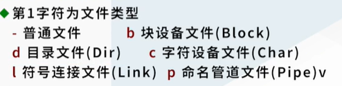
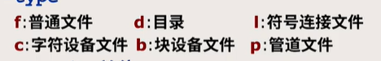

# 文件命名规则

## 名字长度

1. 一般允许为1-255字符，老版本可能为1-14


## 合法字符

1. 除了斜线`/`外的所有字符都是合法字符，包括不可打印的字符。<span style = "color:red">字节0除外</span>
2. 斜线留作路径分割
3. Linux对大小写敏感。<span style = "color:orange">Windows对大小写不敏感</span>


## /etc目录

1. 供系统维护管理用的命令和配置文件，文件格式为文本文件，类似于Windows的注册表信息

2. 常见的包括：

   |       文件名       |           功能           |
   | :----------------: | :----------------------: |
   |   passwd，hosts    |         用户信息         |
   |     *.conf文件     |         配置文件         |
   | ssh, network目录等 | 远程登录的终端配置信息等 |
   |       rc*.d        | 系统启动阶段初始化的脚本 |


## 	其他目录

|          目录名          |                             功能                             |
| :----------------------: | :----------------------------------------------------------: |
|         **/tmp**         | 临时文件，每个用户都可以在这创建临时文件，<span style = "color:red">但删除的时候只能删除自己的文件</span> |
|         **/var**         |               存放需要修改的内容，比如日志文件               |
|         **/bin**         |                 系统常用命令：ls，cp，cat等                  |
|       **/usr/bin**       |              存放常用命令：ssh，ftp，gcc，git等              |
| **/lib**或者**/usr/bin** |         链接库。Linux逐渐采用动态链接库节省内存开销          |


### 文件通配符 ###

1. 星号`*`

   1. 匹配任意长度的文件名字符串，<span style = "color:red">包括空字符串 </span>

   2. <span style = "color:red">点字符`.`作为文件名的第一个字符时，必须**显示**匹配：</span>

   > *file 匹配 sfile，但是不匹配.file

   3. 斜线(/)也得显示匹配

2. 问号`?`匹配任意单字符

3. 方括号 `[]` 匹配括号内任意单字符，也可以用减号 - 指定范围：[A-Z]*

4. 波浪线`~`：bash特有，匹配用户目录。

   > ~:匹配当前用户的主目录
   >
   > ~ jiang：匹配用户jiang的主目录

5. 单个的点表示当前目录，两个点表示上一级目录。<span style = "color:red">注意文件通配符中的圆点和正则式里的圆点是不同的效果</span>


### 通配符匹配过程

#### kernel

操作系统核心，通过软件中断的方式向用户态提供接口

#### shell 

是一个用户态进程，对用户提供命令行界面，也可以启动其他应用程序

+ 本质：shell根据用户输入的字符串，在系统中寻找同名字的可执行文件去执行，执行的是搜索功能，至于实际的操作，和可执行文件本身相关，与shell无关
+ 在shell对文件名补全的时候，<span style = "color:green">采用的是字典顺序进行补全</span>


#### 通配符和正则式的区别 ####

```shell
grep a*.c test.c   
grep 'a*.c' test.c
grep 'test*' test*.c test1.c
# 假设当前文件目录下只有两个文件：a1.c 和 a2.c
```


在命令1中，没有单引号的情况下，shell会先采用文件通配符的方式展开，实际执行的内容为

```powershell
grep a1.c a2.c test.c   # 在a2.c和test.c 中寻找正则式a1.c
```


在命令2中，a*.c是作为参数直接传入到grep指令中，也就是在test.c中寻找正则式a1.c

在命令3中，会在test.c, test1.c, test1.c中寻找test*正则式匹配的行


# 文件管理系统

## ls指令

### 基本功能

1. 不给出实参的情况下，列出当前目录下所有的文件和目录
2. 实参为文件时，列出文件项
3. 实参为目录的时候，列出目录下所有的文件

### 常用参数

### -F（Flag）：对列出的不同文件类型做出不同的标记

1. 列出的是目录，就在名字后面加斜线
2. 列出的是可执行文件，在名字后面加上星号*
3. 列出的是符号链接文件，就在名字后面加上符号@

### -l 长格式列表

1. 第一列：

   1. 第一个字符：文件属性：
   2. 第2~4字符：文件所有者对文件的访问权限
   3. 第5~7字符 ：同组用户对文件的访问权限
   4. 第8~10字符：其他用户对文件的访问权限

2. 第二列：文件的link数

3. 第三列第四列：文件主的名字和组名

4. 第五列：文件的大小：

   > 普通文件列出文件的字节数
   >
   > 目录文件列出的是**目录表**的大小，**不是目录下文件的总大小**
   >
   > 符号链接设备：列出符号连接文件自身的长度
   >
   > 字符设备和块设备文件：列出主设备号和次设备号
   >
   > > 主文件号：Linux系统的硬件设备的设备号

5. 第六列：文件的最后一次修改日期

6. 第七列：文件名


### 其他常见选项

|       选项       |                             功能                             |
| :--------------: | :----------------------------------------------------------: |
|     -h：阅读     |          将数值打印成为方便阅读的模式：1K，12M，2G           |
|     -d:目录      |    当参数为目录时，列出目录自身的信息，而不是目录下的文件    |
| -a(all):所有信息 | 类似的命令还有-A，列出所有的隐藏文件（以圆点开头的文件），-A不会列出圆点和双圆点开头的文件 |
|    -s（size）    |                    列出文件占用的磁盘空间                    |
|    -i(i-node)    |                      列出文件的i节点号                       |


## cp指令

### 基本功能：

拷贝文件：
```shell
cp file1 file2 :file2会被创建或者覆盖 
cp file1 file2 …… filen dir:将文件1到n拷贝到目录dir下
```
### 使用注意

cp指令可以将指定目录下的文件通过文件名匹配的方式，拷贝到命令行的当前目录下
```shell
cp backup/p*.c .  # 注意最后的一个圆点，表示当前目录
```
表示将backup目录下，所有以p开头，以.c为后缀的文件，拷贝到当前命令行目录下


<span style = "color:red">一种特殊情况</span>

```shell
cp backup/p*.c   #假设backup文件夹下只有两个文件：p1.c和p2.c
```

实际执行的效果等效于

```shell
cp backup/p1.c backup/p2.c
```

相当于用p2.c覆盖了p1.c。如果文件下还有p3.c，则会因为输入了三个参数而报错

## mv指令

### 基本用法
```shell
mv file1 file2  # 删除file1，创建file2.如果file2已经存在，则覆盖
mv file1 file2 …… filen dir # 移动文件到dir目录下
mv dir1 dir2  # 移动dir1整个文件夹和下面的文件到dir2下
```
## rm指令

### 基本用法
```shell
rm file1 file2……：删除所有file文件
```

<span style = "color:red">注意事项：</span>

```shell
rm * .bak  # (星号和.bak之间有一个空格)
```
此时不再是删除所有.bak后缀的文件，而是先删除整个文件下的所有文件（*拓展），再删除.bak文件（其实此时已经没有.bak文件可以删除了）


### 参数

### -r：递归删除

删除实参列表中的目录，也就是删除一整课目录树

### -i(inform)：删除确认

每个文件删除之前都需要操作员确认

### -f :强迫删除

删除用户权限内所有可删除的文件，<font color = "red">包括只读文件</font>

> 一些文件，用-f也无法删除：
>
> 1. 正在运行的可执行程序文件
> 2. 高于当前用户权限的文件（比如普通用户删除root用户的文件）

### 命令显式区分选项

### 情况

为了删除目录下名为“-i”的文件，不能直接输入**rm -i**或者**rm \* **

此时需要显式声明命令行选项：在输入完所有的选项后，单独输入一个**--**用于区分

> rm -f -- -i :强制删除名为-i的文件


## 路径管理

### 主目录

1. 每个用户都有一个自己独立的主目录
2. 可以使用env命令查看环境变量的值

### 指令

### mkdir

创建目录：

1. 使用-p选项，可以创建目录树（即补全输入的路径下所有的文件夹）

### rmdir

删除目录

1. 要求删除的目录下不能有任何文件
2. 可以使用rmdir -r来删除含有子目录的目录

### cp：复制目录

cp -r dir1 dir2:递归复制目录dir1。

> 如果dir2不存在的话，新建子目录dir2，再把dir1下的内容拷贝到dir2下
>
> 如果dir2已经存在，则在dir2下新建子目录dir1，把dir1下的内容拷入dir2/dir1下

2. -v：冗长方式：复制目录的时候实时显示当前拷贝	的文件的名字
3. -u：增量拷贝，用于备份目录。类似git指令，只在复制时更新文件或增加文件，不去复制已经存在的文件


### cd :移动目录

1. `cd`后面不接任何参数，返回用户目录下

2. <span style = "color:red">cd是shell的一个内部命令</span>

   > 内部命令（常见的包括cd, echo, history）会在shell启动的时候一起加载，执行时不需要创建新的进程
   >
   > 外部命令（以ls为例）在运行时，shell会在bin目录下寻找文件，并创建一个新的进程执行该命令


### rsync：数据备份工具，采用增量拷贝的方式进行备份


### 遍历目录树

### find指令

### 基本功能

1. 从指定的查找范围开始，递归查找子目录

2. 凡是满足条件的文件或者目录，执行规定的动作

   > find ver1.d ver2.d -name '*.c' -print:找到文件夹ver1,ver2下所有以.c为后缀的文件，并打印这些文件的路径名
   >
   > 注意：find命令中，-name选项里，输入的匹配语句一定要带引号，且采用的匹配模式是shell文件匹配，而不是正则匹配


### 条件选项

1. -name wildcard: 文件名与wildcard匹配
> 注意事项：
> 1. wildcard需要带引号
> 2. 这里的文件名指的是路径名中的最后一部分

2. -regex pattern:
整个路径名与pattern匹配
3. -type 文件类型：
根据类型去搜索文件
类型包括：
4. -size +/- n单位：
指定文件大小（大于是+，小于是-，等于就直接输入数据大小）
单位有：c（字符）,b（块，512字节）,k,M,G   其中默认为b

5. -mtime +/-ndays:

文件最近的修改时间来查找

6. -newer file:

查找最近修改时间晚于file的文件


### 执行动作

1. -print：打印查找的文件路径名

2. -exec：对查找到的目标执行某一命令

   ```shell
   find /lib/usr -name 'test.[ch]' -exec ls -l {} \;
   # 两个大括号之间没有空格，表示find找到的路径名。大括号和反斜杠之间的空格必须要有
   # -exec到分号之间的内容作为一条命令执行，分号前要加反斜杠
   ```

3. -ok：与-exec相似，只是执行前需要进行确认

   ```shell
   find ~ -size +100k \(-name core -o -name '*.cpp'\) -ok rm {} \;
   # 功能：在用户目录下找到所有叫做core以及所有的cpp文件并删除，删除前需要执行确认
   # 通过括号可以实现“或”的逻辑
   ```


### 实践操作

1. ```shell
   find src -name test.c -exec grep -- --help {} /dev/null \;
   # 功能:在src文件夹里寻找test.c文件，并查找其中带有“--help”的行
   # 由于grep在执行的时候，如果查找的文件是单个文件，则输出的时候是不显示路径名的。为了强制打印通过find找到的文件路径名，需要加入一个额外的文件，使grep为了区分而打印文件名
   # 这时，就需要使用/dev/null文件路径。该路径不含有任何内容，仅仅是为了凑数的文件。
   ```


### xargs指令

### 作用

将上一个命令的结果作为参数传递到自己的指令里。如果参数量过大，会自动实现分批传输，实现节约内存的效果

可以与find指令结合，实现精简的效果

## 压缩

### tar指令

### 语法

> tar ctxv[f device] file-list:
>
> > ctxv：四种参数分别指代四种不同的功能：
> >
> > 1. c:创建新磁带，将以前存在磁带上的数据抹除
> > 2. t：列出磁带上的文件名列表，不指定文件名的时候，列出所有文件
> > 3. x:从磁带中抽取指定的文件
>
> 

