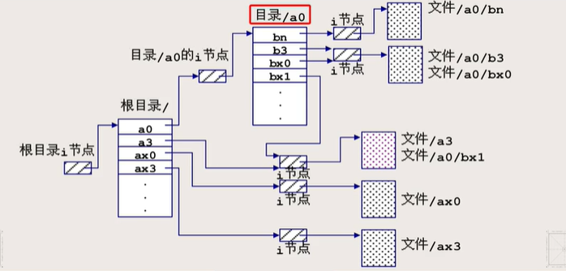

# Linux命令风格

## Linux系统命令和用户程序

#### 地位

Linux系统命令shell和用户程序都属于用户态程序，运行时需要获取的信息包括配置信息，处理方式（选项参数），被处理对象

##### 配置信息

定义在程序中的宏变量或者静态变量

###### 运行时获得信息的方式（易变性从小到大）

1. 配置文件：复杂程序会提供配置文件存储配置信息，分为***系统级***和***用户级***偏好设置
2. 环境变量：可以使用env命令打印当前的环境变量。这些信息在一段时间内会反复使用
3. 命令行参数：
4. 交互式键盘输入：

###### 命令行参数的三种风格

1. 类似dd命令的风格：采用param = value的风格

2. 类似find和gcc风格：以减号打头的***由多个字符构成的单词***用作选项
3. 类似ls风格 


# 文件系统

## 根文件系统与子文件系统

#### 根文件系统root filesystem

是整个文件系统的基础，不能umount（脱卸）

#### 子文件系统

包括硬盘，软盘，USB盘等，在根文件系统中以子目录的身份出现

#### 独立存储结构

根文件系统和子文件系统都有独立的文件系统存储结构和格式

##### 创建文件系统

> mkfs /dev/sdb

在块设备文件/dev/sdb上创建文件系统，本质上是格式化一个磁盘块

##### 安装文件系统

> mount /dev/sdb /mnt 

mnt可以是任意一个事先建立好的空目录名，允许处于根文件系统中的任何目录。执行命令后，/mnt就是子文件系统的代名词

##### 卸载文件系统

> umount /dev/sdb

##### 文件系统空闲空间

> df 

查看各个文件系统下的磁盘占用情况。-h参数可以转换容量数据为MB，GB单位

## Linux文件存储结构

#### 文件系统的结构

整个逻辑设备以***块（扇区）***为单位划分，编号为0,1,2，每块都是2的整数幂大小（常见为512KB）

##### 引导块（0号）

用于启动系统，只有根文件系统的引导块有效

##### 专用块（1号块）

也叫管理块，或者超级块，用于存放文件系统的管理信息，空闲块链表的头等

##### i节点区

1. 由若干块构成，在mkfs命令创建文件系统时确定
2. 每个文件都对应一个i节点，i节点中的信息包括：
   1. 指向文件存储区的索引
   2. 指针（文件的逻辑块和硬盘物理块之间的映射）
3. 其中对用户可见的信息有：文件类型，归属着，组，权限，link数，大小，时间戳，<font color = red>***不包括文件名***</font>

##### 文件存储区

存放文件数据的区域，包括目录表

#### 目录存储结构

##### 目录表

目录表自身是作为文件来被管理的，存于文件存储区中，有自己的i节点和数据存储块

目录表由若干个***目录项***构成，只包含<font color = red>文件名</font >和i节点号信息

ls指令只能列出目录表自身的文件大小



> 目录表和i节点分离存储的目的
>
> 如果目录表存储所有的文件信息，则每一个目录项的大小会远远大于一个i节点的指针。寻找文件的时候，是需要将目录表从硬盘调入内存，再依次寻找。
>
> 由于每次调入的单位是内存的“块”。如果目录表很大，则一次调入的块里只能包含很少的几个目录信息。如果采用分离目录和i节点的方式，则一次可以调入很多的目录信息，便于寻找

## 硬链接

#### 含义

1. 一个目录表由目录项构成，目录项是一个“文件名-i节点”对
2. 由于一个目录表可以有多个目录项，任意两个目录项可能指向同一个i节点
3. 每个目录项指定的“文件名-i节点号”映射关系叫做一个***硬链接***
4. ***硬链接数目（Link数）***：同一个i节点被目录项引用的次数

#### 硬链接指令

```shell
ln chapt0 intro  # 在当前目录下创建一个目录项intro，目录项对应的i节点号是chapt0
```

生成的chapt0和intro地位平等

##### 使用要求

1. 不允许对目录文件使用ln指令创建硬链接
2. 一般来说，目录文件的link数 = 直属子目录数+2（多出来的两个分别是：上一级目录指向，自己指向（目录中的圆点目录））。直属子目录中的`..`项指向目录的i节点

## 软连接/符号链接

#### 结构

保存的是一个***符号链接文件***，保存文件的绝对路径名构成的字符串

#### 使用

1. 命令：ln -s
2. 符号链接包含绝对路径名，则引用绝对路径名
3. 如果包含相对路径名，则引用相对于***符号链接文件的位置***(不是相对调用进程的当前工作目录)

#### 特点

1. 在算法软件层面上实现
2. 适用于目录文件和各种文件系统
3. 相对于硬链接，要占用操作系统内核的一部分开销

# 系统调用

## 作用

操作系统内核提供的编程界面，是应用程序ap和操作系统kernel交互的唯一手段

> 常见的指令：文件的read，close，open等

#### 系统调用和库函数

##### 区别

1. 例如：获取进程ID的getpid()和字符串拷贝函数strcpy()
   前者需要操作系统对CPU发出软中断指令，而后者是调用一个子函数
2. 库函数中，有可能有对系统调用的封装API，使得函数的执行效率更高
   例如：printf是对系统调用write的封装
   malloc和free是对系统调用的sbrk的封装

#### 返回值

一般返回的是一个整数值，大于或者等于0表示成功，-1表示调用失败

1. 有一个全局整形变量errno，在C语言的标准库<errno.h>中，会自动记录系统调用失败后的错误代码
2. errno变量记录的错误报告不易理解，可以采用函数strerror对错误代码进行转化，转为易于理解的字符串，采用printf("%m",errno)也可以做到相似的效果

## 访问i节点和目录

#### stat/fstat系统调用

从i节点中获得文件状态信息

1. stat的参数：指定路径名
   fstat的参数：一个已经打开的文件的文件i节点
2. 